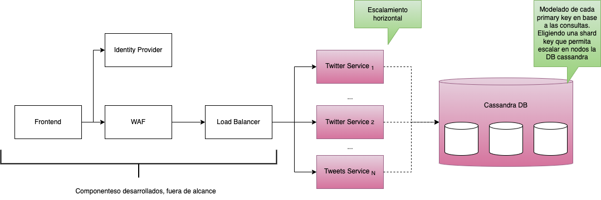
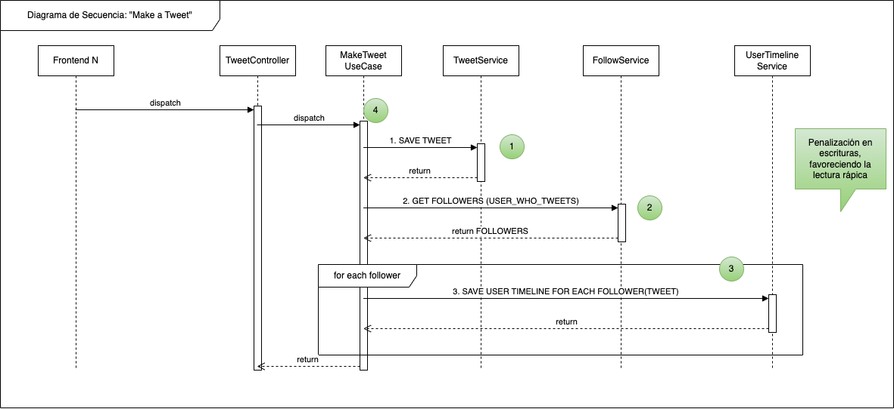
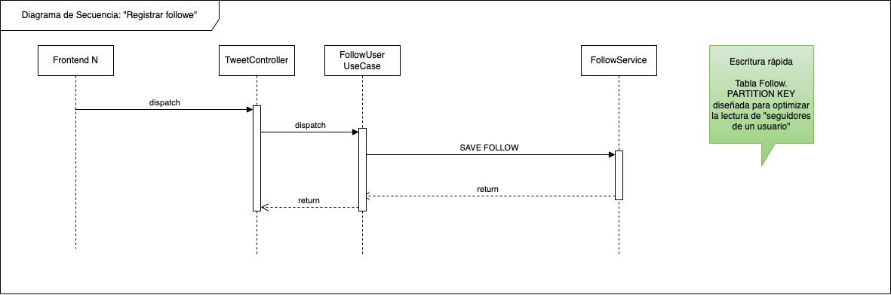

## Twitter Challenge
_Macarena Lepera_

## Solución propuesta


### Aplicativo
- Escalamiento horizontal del Twitter Service
- Posee un api con tres controllers, uno por operación. Ver coleccion de postman adjunta
- Posee una arquitectura en "clean", en donde se buscan abstracciones de dominio.
- Particularmente, me gusta mucho el enfoque DDD, buscando que las abstracciones esten bien modeladas y no hayan clases anémicas.
- Oportunidades de mejora:
  - Usar Spring Reactor. Que tiene un mejor manejo de hilos y memoria respecto a Spring MVC.
  - Mejorar tratamiento de errores

### Persistencia
- Selección de Cassandra, como motor de base de datos. Debido a ser ideal para este tipo de casos, en donde se requieren lecturas rápicas y tablas modeladas según la consulta necesaria, al estilo de vistas, pero orientado a Big Data. 
- Modelé cada tabla teniendo en cuenta las lecturas que iban a efecturarse. Shard key en general es el usuario que se consulta, de esta forma se puede particionar la base de datos y aumentar disponibilidad, resiliencia, se pueden generar réplicas, etc.

### Infraestructura
Proyecto dockerizado.
1. Inicializa la base de datos.
2. Inicia el servicio. A su vez, inicializa el dataset y el esquema de BBDD.

Posicionarse en la raiz del directorio y ejecutar
```
docker-compose up -d
```

En caso de ejecutar el servicio manualmente, brindarle la variable de entorno `SPRING_DATA_CASSANDRA_CONTACT_POINTS=127.0.0.1`


## Casos de uso

### Obtención de 'User Timeline'


Orienté el diseño en que la operación más rápida sea el user timeline, en donde una persona, desea ver los tweets de las personas que sigue.
Generé una tabla UserTimeline que, ante cada tweet, se buscan los seguidores de la persona para luego, hacer un insert en cada seguidor. Tal como se ve en el diagrama de secuencia siguiente.



De esta forma, se penalizaron las escrituras, en virtud de tener una carga de home rápida.
No obstante, detecté cuatro oportunidades de mejora para mejorar el rendimiento. 

Punto número 1. La persistencia del tweet no afecta la actualización del timeline. Entonces, se podría dejar síncrono en el llamado, la persistencia del tweet y luego, todo lo demás, asíncrono. (puntos 2 y 3).
Punto número 4. Dependiento de cuán asincrono lo querramos, todo podría ser asincrono. Teniendo como premisa minimizar el tiempo del usuario en pantalla, 



Por último, el servicio de registro de seguidores.

### Pruebas sugeridas
1. Inicializar el proyecto a través de docker compose
2. En la carpeta docs, disponen de una colección de postman en donde tienen invocaciones de los 3 endpoints.
3. Opcion manual:

Paso 1. Usuario 1, sigue a usuario 2.
```
curl --location 'localhost:8080/api/follow' \
--header 'user-id: 1' \
--header 'Content-Type: application/json' \
--data '{
"userFollowedId": "2"
}'
```

Paso 2. Usuario 2 twittea

```
curl --location 'localhost:8080/api/tweet' \
--header 'user-id: 2' \
--header 'Content-Type: application/json' \
--data '{
    "content": "Hermosa mañana, verdad?"
}'
```

Paso 3. Al obtener el timeline del usuario, tiene el tweet del usuario 2 (porque lo sigue)
```
curl --location 'localhost:8080/api/timeline' \
--header 'user-id: 1'
```


### Oportunidades de mejora en general
- Testing
- Despliegue continuo con controles de calidad y detección de seguridad
- Despliegue de la solución
